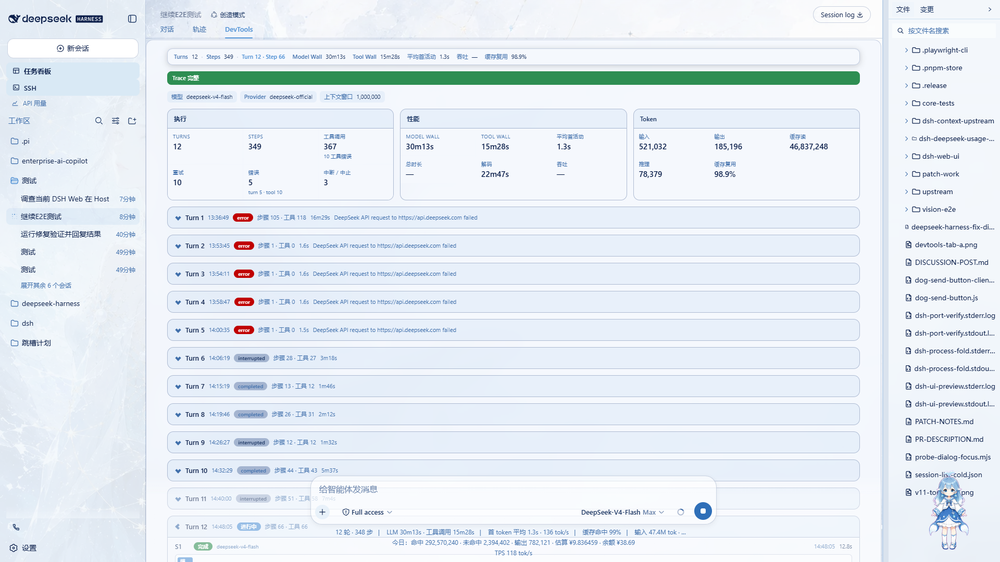

# dsh-devtools

Read-only runtime observability for DeepSeek Harness agents.

一个社区（community）插件：把会话的持久化事件日志折叠成 **Agent Runtime Profiler**，
在 Web GUI 的会话视图里以 DevTools 标签页展示每次模型调用（Step）与回合（Turn）的
执行事实——模型归属、延迟、工具调用、重试与回合结局。只读、不拦截、不修改任何请求。

> 本插件不是 DeepSeek 官方发布的插件；它基于官方 NPM SDK
> （`@deepseek-ai/*`）开发，通过 DSH 的 cordis patch + profile 机制挂载。

## 1. What it does

公开版 0.1 提供的能力（全部来自对持久化会话事件的只读折叠）：

- **Runtime Profiler**：一眼看出 agent 做了什么、哪里最慢、哪里异常
- **Agent Turn / Step runtime trace**：按回合与步骤还原 agent 执行时间线
- **Step runtime timeline**：同一回合内的 model / tool 时长条按同一时间轴缩放；
  并行工具调用分 lane 表达并行，极短工具保留最小可见宽度（tooltip 显示真实值），
  运行中的活动带 running 状态，失败工具带 error 标记
- **Turn collapse / expand**：进行中的 Turn 与最新 Turn 默认展开，较早 Turn 默认折叠；
  折叠摘要展示 Turn 号、状态、步骤数、工具数与耗时；2 秒轮询刷新不会重置手动折叠状态
- **Summary 三组**：
  - **Execution**：Turns / Steps（含 completed · running 计数）/ Tool Calls / Retries /
    Errors（step / turn / tool 三类错误独立统计）/ Interrupted / Aborted
  - **Performance**：Model Wall / Tool Wall / Avg First Activity / Wall Time / Decode / Throughput
  - **Tokens**：Input / Output / Cache Read / Reasoning / Cache Reuse
- **model / provider attribution**：每个 Step 标注调用当时的模型与提供商
- **TTFT / first-activity**：由 `step/start` 到首个持久化 block-start 的时间戳派生
  （UI 简称 Avg First Activity，tooltip 说明与 TTFT 的关系，不冒充 Provider 官方上报值）
- **Model Wall / Tool Wall**：`assistantAt - startAt` 的模型侧 Wall 时间；
  `tool/call -> tool/result` 的工具 Wall 时间（tooltip 说明含调用与结果之间的全部等待）
- **tool errors**：结构化失败码（如 `FS_NOT_FOUND`、`ABORTED`）标记在单个工具上
- **retry trace**：`llm/retry` 事件出现时，按 Step 归属展示 retry/maxRetries/delay/code
- **provider-reported usage**：input / output / cacheRead / reasoning tokens；
  cache reuse = `cacheRead / (input + cacheRead)`（内部派生指标，非 Provider 官方缓存命中率）
- **回合结局**：`completed` / `aborted` / `interrupted` / `error` / `max-tokens` / `blocked`
  等 `turn/end.reason` 的正确映射；Turn 级结局与 Step 状态、工具错误分开统计
- **trace completeness**：顶部横幅显示 `Trace complete`；发生 ring 淘汰时显示
  `Partial trace · N earlier steps omitted`，不把截断后的页面伪装成完整历史
- **live session 与 cold/history session**：内存日志增量折叠；持久化会话从落盘日志重建
- **subagent metadata**：subagent 会话的 label / mode / agentModel
- **hook trace**：`hook/invoked|hook/result` 事件存在时展示执行耗时与错误标记；
  无 producer 时显示语义准确的空状态（不暗示"没有执行任何 Hook"）

以下能力**不属于公开版 0.1**，本版本不实现：mutation provenance、request diff、
prompt diff、context composition / context inspector、tool dispatch breakdown、
plugin token attribution。

## 2. Architecture

```
Durable Session Event Log
        |
        v
     Pure Fold
        |
        v
 Runtime Trace Snapshot
        |
        v
 /dsh-devtools RPC
        |
        v
 conversation.view / DevTools
```

- **read-only**：插件只消费已提交的会话事件，不注入、不拦截、不修改任何请求
- **zero behavior modification**：不改变 agent 的输入、输出或执行路径
- **no request interception / no request mutation**
- **durable-events-first**：live 会话直接折叠内存日志（增量、无克隆）；
  cold 会话经 `sessionQuery` 从持久化日志重建并缓存（日志不再增长）

## 3. Privacy / Security

**metadata-first by design**：默认不读取、不保存、不通过 RPC 返回——

- prompt / system prompt 正文
- user message content
- assistant message content
- tool arguments
- tool result text
- API key / secret

RPC wire 只携带运行时 metadata：类型、时间戳、ID、名称、状态、usage 计数等必要字段。

有自动隐私测试（`tests/fold.spec.ts` 的 privacy 用例），并经过真实会话 E2E 的
RPC + DOM privacy audit（对 wire JSON 与渲染页面全量扫描 prompt / tool args /
tool result / API key 模式，无泄漏）。

## 4. UI

DevTools 通过 `conversation.view` slot 注册，位于标签页环的最右侧：

```
Chat | Trajectory | Context | DevTools
```

DevTools 拥有独立宽布局（不受聊天阅读宽度限制，自适应桌面/窄窗，小窗口自动单列），
并在高细节背景皮肤上使用主题 token 的半透明遮罩 + blur 保证可读性。



- **Sticky runtime status bar**：Turns / Steps / 当前 Turn·Step / Model Wall /
  Tool Wall / Avg First Activity / Throughput / Cache Reuse；窄屏自动隐藏次要指标
- **Summary 三组**：Execution / Performance / Tokens（见 What it does）
- **逐 Turn 卡片**：结局徽章 + 步骤数 + 工具数 + 耗时，可折叠/展开
- **逐 Step 行**：状态、模型、TTFT / model / decode / wall、usage、
  runtime timeline 时长条、工具 chips、retry chips
- **hook 执行表**：有事件时展示，无事件时显示语义空状态

## 5. Installation

### After npm publication (recommended)

一条命令安装（无需 clone 仓库、无需构建、无需手改 profile）：

```bash
dsh plugin --profile web add dsh-devtools
```

其他 profile：

```bash
dsh plugin --profile <name> add dsh-devtools
```

启动：

```bash
dsh web
```

### Local development / local installation

从本仓库以 `file:` 依赖安装（仅限开发调试）：

```bash
# 1. 在仓库内构建
pnpm --filter dsh-devtools build

# 2. 加入 web profile（file: 依赖）
cd ~/.dsh/profiles/web
pnpm add "dsh-devtools@file:<本仓库绝对路径>/packages/dsh-devtools"
# 并在 package.json 的 dsh.profile.bundles 追加 "dsh-devtools"

# 3. 重启 dsh web
```

## 6. Development

```bash
pnpm --filter dsh-devtools typecheck
pnpm --filter dsh-devtools test
pnpm --filter dsh-devtools build
```

## 7. Known limitations

- `hook/invoked | hook/result`：当前验证环境没有 producer，真实 hook 数据路径
  未做 E2E；fold 对缺失与未配对事件做了防御性处理并有自动测试
- real-world LLM retry E2E 尚未覆盖（需要 API 层故障才能真实触发）；
  自动测试已覆盖 retry 归属与字段展示语义
- `droppedSteps` ring truncation（默认保留最近 1000 个 Step）未做真实超长会话
  E2E；自动测试覆盖裁剪与上报语义，UI 以 partial-trace 横幅如实展示
- TTFT 定义为 `step/start -> 首个持久化 block-start chunk` 的时间差
  （非 Provider 官方上报的 TTFT）
- Tool Wall 本质为 `tool/call -> tool/result` 的 wall time，包含调用与结果之间
  的全部等待；不拆分 queue / dispatch / execution（属未来版本）
- cache reuse 为内部派生指标 `cacheRead / (input + cacheRead)`，
  不是 Provider 官方缓存命中率
- 公开版 0.1 不做 request mutation provenance / tool dispatch breakdown（属未来版本）

## 8. Compatibility

Verified against DeepSeek Harness `v0.1.0-rc.6`（npm 版，web profile 挂载实测；
真实会话 E2E 通过）。其他版本未验证。

## License

BSD-3-Clause（见 `LICENSE`）。
